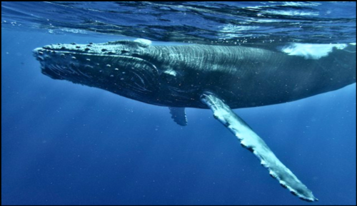

# Whale Sightings

  
Photo by <a href="https://unsplash.com/@mero_dnt?utm_content=creditCopyText&utm_medium=referral&utm_source=unsplash">Chinh Le Duc</a> on <a href="https://unsplash.com/photos/a-humpback-whale-swims-under-the-surface-of-the-water-8t9uyncwnHc?utm_content=creditCopyText&utm_medium=referral&utm_source=unsplash">Unsplash</a>
  

### This is a data engineering project focused on processing and managing whale sighting data. It sends requests to the Ocean Biodiversity Information System's API to extract relevant data, then validates, processes and cleans it, and finally stores it in a MySQL database.

## Tools

* _Python_
* _Pandas_
* _GeoPandas_
* _Pydantic_
* _MySQL_
* _Typer_

## Citations
OBIS 2024 Ocean Biodiversity Information System.  
Intergovernmental Oceanographic Commission of UNESCO.  
[www.obis.org](www.obis.org.)  

Flanders Marine Institute (2021). Global Oceans and Seas, version 1.  
Available online at https://www.marineregions.org/. https://doi.org/10.14284/542.

## License
[MIT](https://github.com/jarretjeter/whale-sightings/blob/main/LICENSE.txt)

#### Contact me here on github or at jarretjeter@gmail.com if you have any questions or issues.